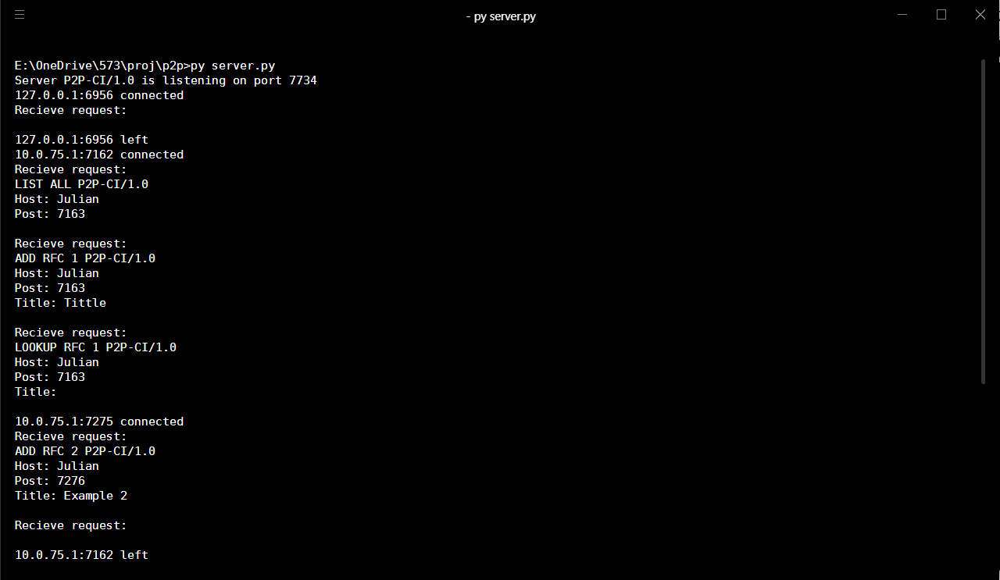
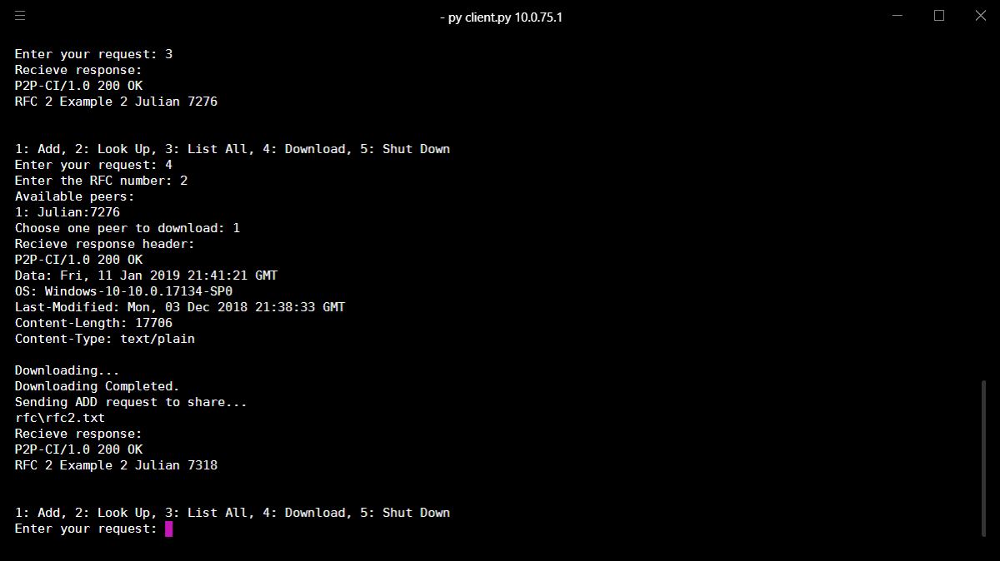

# Peer-to-Peer with Centralized Index (P2P-CI) System

This application is a P2P file sharing system with a centralized index (CI), in which peers who wish to download a file that they do not have in their hard drive, may download it from another active peer who does. All communication among peers or between a peer and the server will take place over TCP. 

The project goals:
- Becoming familiar with network programming and the socket interface
- Creating server processes that wait for connections
- Creating client processes that contact a well-known server and exchange data over the Internet
- Defining a simple application protocol and making sure that peers and server follow precisely the specifications for their side of the - protocol in order to accomplish particular tasks
- Creating and managing a centralized index at the server based on information provided by the peers
- Implementing a concurrent server that is capable of carrying out communication with multiple clients simultaneously

# Screenshot



# Enviroment
- Python 3.7.0(3.5+)

# Instruction
This system includes all the features and functionalities described in the requirements. There are two .py files in the root directory, `server.py` and `client.py`. They are used to start the applications for server and peers accordingly. The `testing-files` directory contains some text files for testing. Each client has his/her own storage space. **If you are testing multiple clients on a single machine, the `client.py` file should be copyed to several different directory to simulate real situation.**

# How to Run
1. Setup Server
Run `server.py` directly. `Ctrl + C` to shutting down the server.
```
python server.py
```

2. Simulate Clients
Each `client.py` starts an application for one client. To run mulpiple clients, copy `client.py` to different directory. Server's host is optional. It will be `localhost` by default.  It will generate an empty directory `rfc` to store this client's file. Put several RFC files under this directory, which means that this client has those RFC files stored in his/her computer.
```
python client.py [server host]
```
If you are runing the server on AWS, input it's public IP as server host. For example, if you have a Linux instance running on 13.25.100.100, run like this:
```
python client.py 13.25.100.100
```
# Command Line Interface
- At server's end, it shows recieved requests and the server's status. No need for input.
- At client's end, it has an operation menu for the client to interact with. Simplely enter the No. of the choice.
